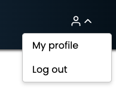
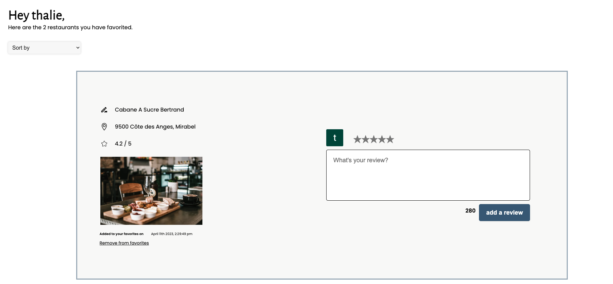
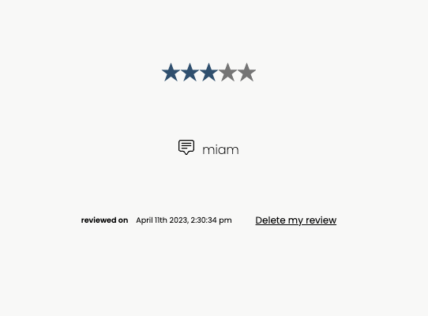
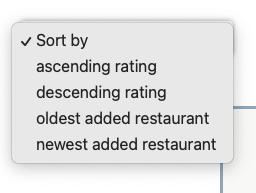
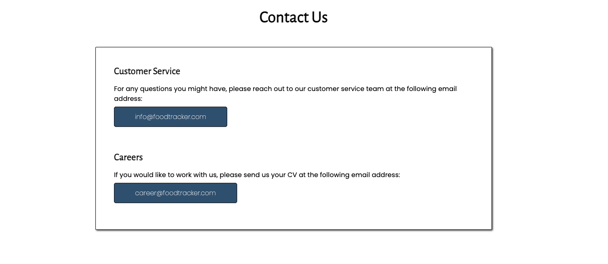
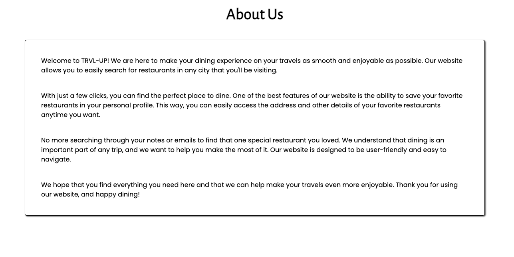

 - 
# Food tracker
My final project for Concordia's Web Development Bootcamp

# Description
This website allows you to search for restaurants in any area by inputting the address, city or country. You can save your favorite restaurants in your profile and leave reviews for the places you've visited to remember your experience for future reference.

## Food tracker contains a few section :

* Homepage when there's no logged in user  

* Homepage when the user's logged in  

* Profile icon to access the profile page or logout  

* Profile page  

* In the profile page, a review from the user  

* In the profile page, a sorting method to sort the favorite restaurants  

* Contact us and About Us page  

### Used Api's : 
I used the Google Maps Api and Auth0 for this project.

### Used Packages : 
 - @auth0/auth0-react
- @react-google-maps/api
- google-map-react
- moment
- react
- react-dom
- react-global-style
- react-icons
- react-rating-stars-component
- react-router-dom
- react-scripts
- styled-components

This project was bootstrapped with [Create React App](https://github.com/facebook/create-react-app).

## Available Scripts

In the client directory, you can run:

### `yarn start`

Runs the app in the development mode.\
Open [http://localhost:3000](http://localhost:3000) to view it in your browser.

The page will reload when you make changes.\
You may also see any lint errors in the console.

In the server directory, you can run:

### `yarn start`

Runs the server at [http://localhost:8888]

